# LangGraph4j support for CopilotKit

Make LangGraph4j compliant with [AG-UI protocol][AG-UI] with [CopilotKit] integration

## Architecture

```mermaid
flowchart LR
    User((User))
    subgraph Browser
        CopilotKitW(Copilot Kit widget)
    end
    CopilotKit(Copilot Kit server)
    LangGraph4JAdaptor(HttpAgent)
    LangGraph4JServer(LG4J AGUI Adapter)
    Agent(Agent)
    subgraph "AG-UI-APP"
        CopilotKit --> LangGraph4JAdaptor
    end
    subgraph "LangGraph4J Server"
        LangGraph4JServer --> Agent(LG4J Agent)
    end
    User --> Browser
    CopilotKitW --> CopilotKit
    CopilotKit --> CopilotKitW
    LangGraph4JAdaptor --> LangGraph4JServer
    %%LangGraph4JServer --> Agent
    Agent --> LangGraph4JServer
    LangGraph4JServer --> LangGraph4JAdaptor
    LangGraph4JAdaptor --> CopilotKit
    Browser --> User
    %% Legend
    %% - The User sends a request to the Copilot Kit.
    %% - The Copilot Kit processes the request and passes it to the LangGraph4J Adaptor.
    %% - The LangGraph4J Adaptor forwards the request to the LangGraph4J Server.
    %% - The LangGraph4J Server processes the request using the Agent.
    %% - The Agent processes the data and sends back a response to the LangGraph4J Server.
    %% - The LangGraph4J Server sends the processed response back to the LangGraph4J Adaptor.
    %% - The LangGraph4J Adaptor then sends the response back to the Copilot Kit.
    %% - Finally, the Copilot Kit presents the results back to the User.

```

## Tech. Stack

* AG-UI community sdk for java version `0.1.1`
* [CopilotKit `4`](https://www.copilotkit.ai)

## References

* [LangGraph4j Meets AG-UI - Building UI/UX in the AI Agents era](https://bsorrentino.github.io/bsorrentino/ai/2025/08/21/LangGraph4j-meets-AG-UI.html)

[AG-UI]: https://docs.ag-ui.com/introduction
[CopilotKit]: https://www.copilotkit.ai
