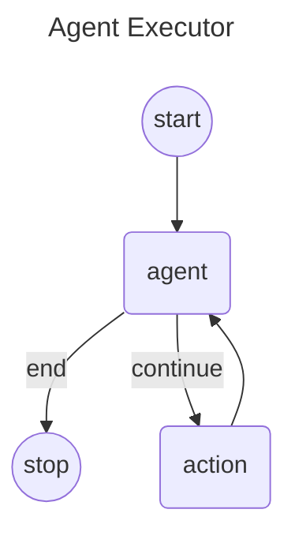

# Langgraph4j - Agent Executor (AKA ReACT Agent)

The "<u>Agent Executor</u>" flow involves a sequence of steps where the agent receives a query, decides on necessary actions, invokes tools, processes responses, iteratively performs tasks if needed, and finally returns a synthesized response to the user. 

This flow ensures that the agent can handle complex tasks efficiently by leveraging the capabilities of various integrated tools and the decision-making power of the language model.

## Diagram



## How to use

```java

public class TestTool {
    private String lastResult;

    Optional<String> lastResult() {
        return Optional.ofNullable(lastResult);
    }

    @Tool("tool for test AI agent executor")
    String execTest(@P("test message") String message) {

        lastResult = format( "test tool executed: %s", message);
        return lastResult;
    }
}

public static String getPCName() {
    return "Langgraph4j";
}


public void main( String args[] ) throws Exception {

    var toolSpecification = ToolSpecification.builder()
            .name("getPCName")
            .description("Returns a String - PC name the AI is currently running in. Returns null if station is not running")
            .build();

    ToolExecutor toolExecutor = (toolExecutionRequest, memoryId) -> getPCName();

    var chatModel = OpenAiChatModel.builder()
            .apiKey( System.getenv( "OPENAI_API_KEY" ) )
            .modelName( "gpt-4o-mini" )
            .logResponses(true)
            .maxRetries(2)
            .temperature(0.0)
            .maxTokens(2000)
            .build();


    var agentExecutor = AgentExecutor.graphBuilder()
                .chatModel(chatModel)
                // add object with tools
                .toolsFromObject(new TestTool())
                // add dynamic tool
                .tool(toolSpecification, toolExecutor)
                .build();

    var workflow = agentExecutor.compile();

    var state =  workflow.stream( Map.of( "messages", UserMessage.from("Run my test!") ) );
    var lastNode = generator.stream().reduce((a, b) -> b).orElseThrow();
    if (lastNode.isEND()) {
        System.out.println(String.format( "result: %s\n", lastNode.state().finalResponse().orElseThrow()));
    }
}
```

## SkillInjector (dynamic skills via tool success)

Tool-call–triggered skills for LangChain4j `AgentExecutor`: activate **skill ids** in Graph State after successful tool results; inject skill **bodies** into the next model request via `ConversationContextPolicy` (bodies never enter Graph State).

### Setup

```java
var injector = SkillInjector.builder()
    .resolver(new MapToolSkillResolver()
        .bind("query_logistics", "order-reply"))
    // pick one body source:
    .skillsFromClassPath("skills")          // classpath:skills/.../SKILL.md
    // .skills(ClassPathSkillLoader.loadSkills("skills"))
    // .skillsFromPath(Path.of("my-skills"))
    // .skillBody(id -> "...")               // custom
    .build();

var graph = AgentExecutor.builder()
    .chatModel(model)
    .toolsFromObject(businessTools)
    .skillInjector(injector)   // executeTools hook + conversation policy
    .build();
```

Static build-time `.skills(...)` on the builder still works for catalog listing in the system prompt; `SkillInjector` is for **runtime activation** after tools succeed.

### Behaviour

| Step | What happens |
|------|----------------|
| Tool succeeds (`ToolExecutionResultMessage` and `isError != true`) | Resolver maps tool → skill ids → merge into `active_skills` via `Command.update` |
| Tool fails / missing result | **No** activation |
| Next `CallModel` | Policy prepends skill bodies to the request message view |
| Graph State `messages` | Unchanged by injection (no skill body persisted) |

### Lifetime

`active_skills` follows Graph State / checkpoint / `threadId`. Same thread without `releaseThread` ≈ Sticky; new thread or `CompileConfig.releaseThread(true)` ≈ Ephemeral.

`AgentExecutor.State.SCHEMA` always includes the optional `active_skills` channel; without `skillInjector`, nothing is activated and ReAct behaviour is unchanged.

### Hooks only

```java
AgentExecutor.builder()
    .addCallModelHook(...)
    .addExecuteToolsHook(injector.executeToolsHook())
    .conversationContextPolicy(injector.asConversationContextPolicy(existingPolicy))
    ...
```

***

> Go to [code](src/main/java/org/bsc/langgraph4j/agentexecutor)


