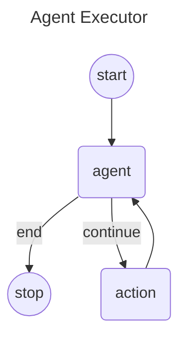

# Langgraph4j - Agent Executor (AKA ReACT Agent)

The "<u>Agent Executor</u>" flow involves a sequence of steps where the agent receives a query, decides on necessary actions, invokes tools, processes responses, iteratively performs tasks if needed, and finally returns a synthesized response to the user. 

This flow ensures that the agent can handle complex tasks efficiently by leveraging the capabilities of various integrated tools and the decision-making power of the language model.

## Diagram



## How to use

```java

public class TestTool {
    private String lastResult;

    Optional<String> lastResult() {
        return Optional.ofNullable(lastResult);
    }

    @Tool("tool for test AI agent executor")
    String execTest(@P("test message") String message) {

        lastResult = format( "test tool executed: %s", message);
        return lastResult;
    }
}

public static String getPCName() {
    return "Langgraph4j";
}


public void main( String args[] ) throws Exception {

    var toolSpecification = ToolSpecification.builder()
            .name("getPCName")
            .description("Returns a String - PC name the AI is currently running in. Returns null if station is not running")
            .build();

    ToolExecutor toolExecutor = (toolExecutionRequest, memoryId) -> getPCName();

    var chatModel = OpenAiChatModel.builder()
            .apiKey( System.getenv( "OPENAI_API_KEY" ) )
            .modelName( "gpt-4o-mini" )
            .logResponses(true)
            .maxRetries(2)
            .temperature(0.0)
            .maxTokens(2000)
            .build();


    var agentExecutor = AgentExecutor.graphBuilder()
                .chatModel(chatModel)
                // add object with tools
                .toolsFromObject(new TestTool())
                // add dynamic tool
                .tool(toolSpecification, toolExecutor)
                .build();

    var workflow = agentExecutor.compile();

    var state =  workflow.stream( Map.of( "messages", UserMessage.from("Run my test!") ) );
    var lastNode = generator.stream().reduce((a, b) -> b).orElseThrow();
    if (lastNode.isEND()) {
        System.out.println(String.format( "result: %s\n", lastNode.state().finalResponse().orElseThrow()));
    }
}
```

## SkillInjector (dynamic skills via tool success)

Tool-call–triggered skills for LangChain4j `AgentExecutor`: activate **skill ids** in Graph State after successful tool results; inject skill **bodies** into the next model request via `ConversationContextPolicy` (bodies never enter Graph State).

### Setup

```java
var injector = SkillInjector.builder()
    .resolver(new MapToolSkillResolver()
        .bind("query_logistics", "order-reply"))
    // pick one body source:
    .skillsFromClassPath("skills")          // classpath:skills/.../SKILL.md
    // .skills(ClassPathSkillLoader.loadSkills("skills"))
    // .skillsFromPath(Path.of("my-skills"))
    // .skillBody(id -> "...")               // custom
    .build();

var graph = AgentExecutor.builder()
    .chatModel(model)
    .toolsFromObject(businessTools)
    .skillInjector(injector)   // executeTools hook + conversation policy
    .build();
```

Static build-time `.skills(...)` on the builder still works for catalog listing in the system prompt; `SkillInjector` is for **runtime activation** after tools succeed.

### Behaviour

| Step | What happens |
|------|----------------|
| Tool succeeds (`ToolExecutionResultMessage` and `isError != true`) | Resolver maps tool → skill ids → merge into `active_skills` via `Command.update` |
| Tool fails / missing result | **No** activation |
| Next `CallModel` | Policy prepends skill bodies to the request message view |
| Graph State `messages` | Unchanged by injection (no skill body persisted) |

### Lifetime

`active_skills` follows Graph State / checkpoint / `threadId`. Same thread without `releaseThread` ≈ Sticky; new thread or `CompileConfig.releaseThread(true)` ≈ Ephemeral.

`AgentExecutor.State.SCHEMA` always includes the optional `active_skills` channel; without `skillInjector`, nothing is activated and ReAct behaviour is unchanged.

### Hooks only

```java
AgentExecutor.builder()
    .addCallModelHook(...)
    .addExecuteToolsHook(injector.executeToolsHook())
    .conversationContextPolicy(injector.asConversationContextPolicy(existingPolicy))
    ...
```

### Unload API (follow-up PR)

PR1 only describes `active_skills` lifetime in terms of Graph State. PR2 adds a
declarative *unload target* so you can make skills
*one-shot (ephemeral)* or *selectively scoped* without relying on
`releaseThread` or manual state surgery.

#### Two activation flavours

| Flavour | When `active_skills` survive | How to enable |
|---------|-------------------------------|---------------|
| **Sticky** (default, PR1 behaviour) | across every `callModel` node until the thread is released | omit unload config |
| **Single-turn** (new in PR2, **recommended**) | cleared after *each* `callModel` node returns | the shorthand `singleTurn()` or `unloadAfterCallModel(UnloadTarget.all())` / `ephemeral()` |
| **Selective** | drop specific ids / ids matching a predicate, keep the rest | `unloadAfterCallModel(UnloadTarget.ids(...) / matching(...))` |

#### Builder setup (single-turn, recommended)

```java
var injector = SkillInjector.builder()
    .resolver(new MapToolSkillResolver()
        .bind("query_logistics", "order-reply"))
    .skillsFromClassPath("skills")
    .singleTurn()   // <== PR2: clear every active_skills after each callModel node returns.
                    //     Alias .ephemeral() is still available if you prefer that wording.
    .build();
```

#### Builder setup (selective scoping)

```java
var injector = SkillInjector.builder()
    .resolver(resolver)
    .skills(skills)
    // Drop a specific list of ids once the following callModel round succeeds.
    // The non-listed ones remain sticky across subsequent turns.
    .unloadAfterCallModel(UnloadTarget.ids("order-reply"))
    // or drop by rule (OPTIONAL V1 CAPABILITY — see note below):
    // .unloadAfterCallModel(UnloadTarget.matching(id -> id.startsWith("tool-guidance:")))
    .build();
```

> **Optional V1 capability: `UnloadTarget.matching(...)`**
> The predicate-based variant (`UnloadTarget.Matching`) is included in this
> PR for completeness, but it is intentionally **not shown in the primary
> builder example**. If maintainers prefer a smaller V1 API surface, the
> `Matching` variant + its factory can be removed in ~30 seconds without
> touching any other file. `Ids` + `All` already cover 95% of the expected
> usages.

#### Static escape hatches (advanced)

Use `SkillInjector.unloadMap(...)` / `SkillInjector.unloadCommand(...)` from
your own hooks when you need to unload inside a channel that isn't the
default `callModel` wrap. Both share the same filter core — no allocation
when nothing would change.

```java
// From a NodeHook.WrapCall that returns a Map channel:
return action.apply(state, config)
    .thenApply(result -> SkillInjector.unloadMap(state.activeSkills(),
                                                  result,
                                                  UnloadTarget.all()));

// From an EdgeHook.WrapCall that returns a Command channel:
return action.apply(state, config)
    .thenApply(cmd -> SkillInjector.unloadCommand(state.activeSkills(),
                                                   cmd,
                                                   UnloadTarget.ids("order-reply")));
```

#### UnloadTarget variants

`UnloadTarget` is a *sealed interface* over exactly four records. Construct
only via the static factories — never `new` the record types directly:

| Factory | Meaning |
|---------|---------|
| `UnloadTarget.none()` | keep everything (no-op) |
| `UnloadTarget.all()`  | drop every active id (ephemeral) |
| `UnloadTarget.ids("a","b")` | drop the listed ids (null-safe, unique'd) |
| `UnloadTarget.matching(predicate)` | drop every id accepted by predicate |

Because the project still targets Java 17, internal dispatch over the
sealed hierarchy uses an `if-else instanceof` chain plus a reflective
`assertPermitsCoverExpected()` self-check — Java 21 switch patterns are
not available at this release level. The self-check runs lazily on the
first real dispatch (interfaces cannot host static init blocks on Java)
and is itself verified by the unit test
`UnloadTargetTest#sealedPermitsCoversAllFourSubtypes`.

#### Scope and exception semantics

- The **recommended** shorthand `singleTurn()` (and its synonym `ephemeral()`,
  carried over from earlier review discussions) really means
  **call-model-turn scoped**: skills live from `executeTools` activation
  through the *next* `callModel` node, and are cleared the moment that
  node returns — not at the end of `invoke()`, not at `releaseThread()`.
  If another tool round activates skills afterwards the pattern repeats.
- If the wrapped `callModel` node completes *exceptionally*, the unload
  step is **not** executed (`thenApply` short-circuits). The previous
  activations therefore remain visible on state / checkpoint. This is
  the fail-open default for V1. Callers that prefer fail-close can use
  the static `unloadMap(...)` / `unloadCommand(...)` helpers on their
  recovery path. The test
  `SkillInjectorUnloadCheckpointITest.exceptionInsideCallModelLeavesActiveSkillsUntouched`
  nails this behaviour and guards it against regressions.

***

> Go to [code](src/main/java/org/bsc/langgraph4j/agentexecutor)


