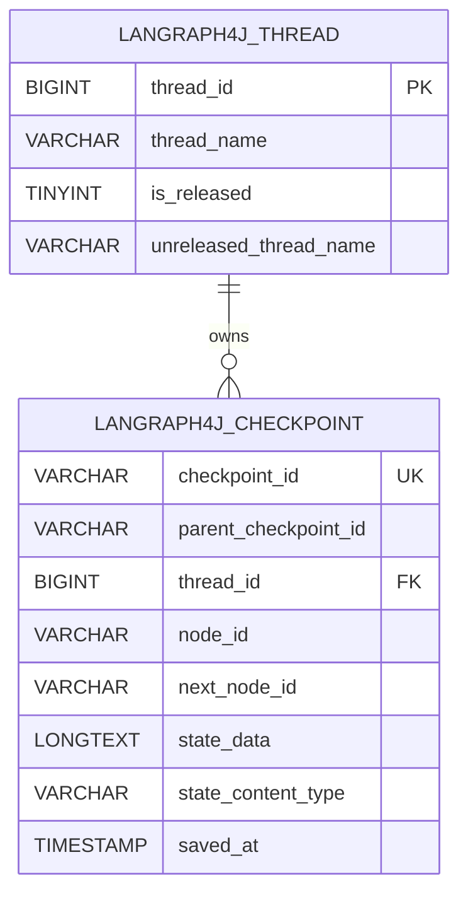

# MySQL Checkpoint Saver V1

Version 1 is implemented by `org.bsc.langgraph4j.checkpoint.MysqlSaver`. It stores each active LangGraph4j thread in `LANGRAPH4J_THREAD` and stores the thread's checkpoint history in `LANGRAPH4J_CHECKPOINT`.

V1 is useful for compatibility with the original MySQL saver schema. New applications should usually start with [SAVER_V2.md](./SAVER_V2.md).

## Data Architecture

The active V1 schema is defined in [`src/main/resources/db/migration/v1.1__init.sql`](./src/main/resources/db/migration/v1.1__init.sql).



Indexes:

- `idx_lg4jcheckpoint_thread_id` supports lookup by thread row.
- `idx_lg4jcheckpoint_thread_id_saved_at_desc` supports loading the newest checkpoints first.
- `idx_unique_lg4jthread_thread_name_unreleased` allows only one unreleased row for a given `thread_name`. MySQL implements this with the generated `unreleased_thread_name` column.

## Design

`MysqlSaver` stores a logical LangGraph4j thread name in `LANGRAPH4J_THREAD.thread_name`. The database row uses an auto-increment `BIGINT` value, and checkpoints reference that row id.

When a checkpoint is saved, the saver:

1. Inserts an unreleased `LANGRAPH4J_THREAD` row if one does not already exist for the configured thread name.
2. Obtains the active row id using MySQL `LAST_INSERT_ID()`.
3. Inserts a `LANGRAPH4J_CHECKPOINT` row with the checkpoint id, node ids, serialized state payload, and serializer content type.

State is serialized through the configured `StateSerializer`. The binary serializer output is Base64 encoded and stored in `LANGRAPH4J_CHECKPOINT.state_data` as `LONGTEXT`.

The `state_content_type` column records the serializer content type. On read, the saver uses that content type to select a matching registered serializer.

## Release Behavior

Releasing a thread updates `LANGRAPH4J_THREAD.is_released` to `1`. The checkpoints remain in `LANGRAPH4J_CHECKPOINT`, but normal V1 checkpoint loading only searches unreleased thread rows.

`MysqlSaver.tag(config, version)` returns `Optional.empty()` in V1. Use V2 when you need versioned release history.

## Limitations

- No release tag table and no versioned lookup for released checkpoint histories.
- No persistent interruption state. `registerInterruption(...)` completes without changing the database.
- Only one active row per `thread_name` is allowed. If the active row is released, later checkpoint loading will not find it.
- V1.1 is not schema-compatible with the earlier V1.0 schema, which used UUID thread ids and a JSON payload column.
- `checkpoint_id` is unique but not the table primary key in the bundled V1.1 schema.

## Build a Saver

```java
import com.mysql.cj.jdbc.MysqlDataSource;
import org.bsc.langgraph4j.checkpoint.CreateOption;
import org.bsc.langgraph4j.checkpoint.MysqlSaver;
import org.bsc.langgraph4j.serializer.std.ObjectStreamStateSerializer;
import org.bsc.langgraph4j.state.AgentState;

var dataSource = new MysqlDataSource();
dataSource.setURL("jdbc:mysql://localhost:3306/langgraph4j");
dataSource.setUser("app_user");
dataSource.setPassword("secret");

var saver = MysqlSaver.builder()
        .dataSource(dataSource)
        .stateSerializer(new ObjectStreamStateSerializer<>(AgentState::new))
        .createOption(CreateOption.CREATE_IF_NOT_EXISTS)
        .build();
```

Use the saver when compiling a graph:

```java
var compileConfig = CompileConfig.builder()
        .checkpointSaver(saver)
        .releaseThread(false)
        .build();

var workflow = graph.compile(compileConfig);
```
