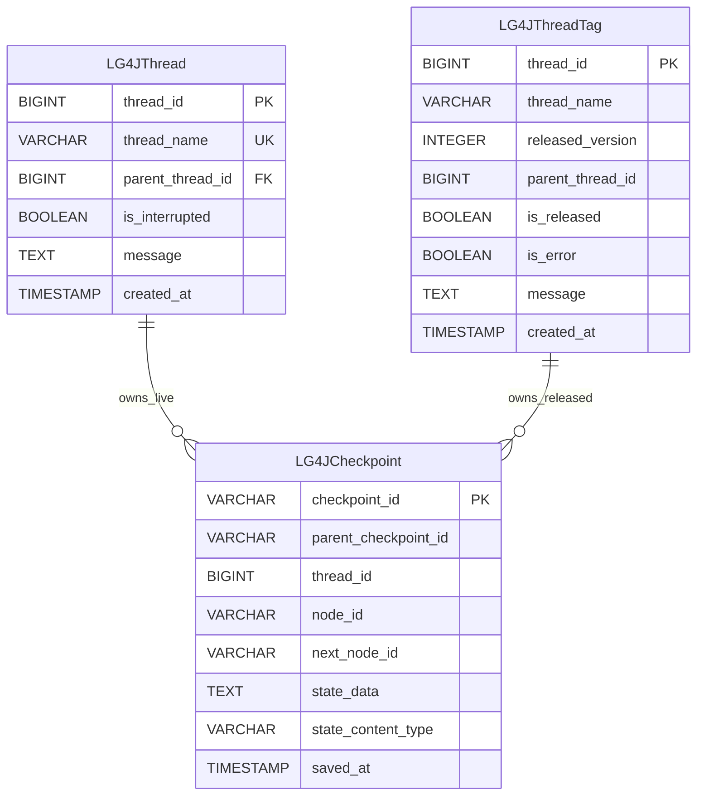

# MySQL Checkpoint Saver V2

Version 2 is implemented by `org.bsc.langgraph4j.checkpoint.MySQLSaverV2`. It extends the original MySQL saver model with release tags, error metadata, and interruption state.

Use V2 for new applications unless you must keep compatibility with an existing [V1](./SAVER_V1.md) schema.

## Data Architecture

The schema is defined in [`src/main/resources/db/migration/v2.0__init.sql`](./src/main/resources/db/migration/v2.0__init.sql).



`LG4JCheckpoint.thread_id` stores the row id from `LG4JThread`. The migration does not define a foreign key from checkpoints to live threads so released checkpoints can continue to reference the archived row id after the live thread is deleted.

## Design

V2 keeps only active executions in `LG4JThread`. The row id is a MySQL auto-increment `BIGINT`, and `thread_name` is unique.

When a checkpoint is saved, the saver:

1. Inserts or refreshes the live `LG4JThread` row for the logical thread name.
2. Obtains the `thread_id` with MySQL `LAST_INSERT_ID()`.
3. Inserts an `LG4JCheckpoint` row that references that identity value.

When the thread is released, the saver:

1. Copies the live thread row into `LG4JThreadTag`.
2. Assigns the next `released_version` for the same `thread_name`.
3. Records release status, error status, optional message, and original creation time.
4. Deletes the live row from `LG4JThread`.

The checkpoint rows remain associated with the same numeric `thread_id`, which is now represented by `LG4JThreadTag.thread_id`.

## State Serialization

It serializes state through the configured `StateSerializer`, encoding the serializer bytes as Base64 text. `state_content_type` records the serializer content type so the saver can select the correct registered serializer while loading checkpoints or tags.

## Release Tags

`MySQLSaverV2.tag(config, version)` loads checkpoints for a released version from `LG4JThreadTag`.

```java
var config = RunnableConfig.builder()
        .threadId("customer-support-thread")
        .build();

var releasedVersion = saver.tag(config, 1);
```

## Interruption Metadata

`registerInterruption(...)` updates the active `LG4JThread` row by setting `is_interrupted = TRUE` and storing the interruption reason in `message`. This lets external tools or dashboards see that a live thread is waiting for intervention.

## Dashboard Queries

`MySQLSaverV2Dashboard` is a read-only companion for an existing V2 schema. It exposes `selectAllThreads()` and `selectAllTags()`; it does not initialize tables or write checkpoints, releases, or interruptions.

```java
var dashboard = MySQLSaverV2Dashboard.builder()
        .dataSource(dataSource)
        .stateSerializer(new ObjectStreamStateSerializer<>(AgentState::new))
        .build();

var activeThreads = dashboard.selectAllThreads();
var releasedTags = dashboard.selectAllTags();
```

## Limitations

- V2 is not schema-compatible with V1. Existing V1 tables require an explicit migration plan before switching classes.
- `LG4JCheckpoint.thread_id` has no foreign-key constraint in the bundled migration. This is intentional for archived tags, but database cleanup must account for it.
- `thread_name` is unique among live threads, so concurrent executions with the same logical thread name share the same active row.
- Released checkpoints are loaded through `tag(...)`; normal checkpoint loading reads the live thread table.
- `released_version` is assigned by querying the existing maximum for the thread name. Coordinate concurrent releases of the same thread if strict version sequencing is required.

## Build a Saver

```java
import com.mysql.cj.jdbc.MysqlDataSource;
import org.bsc.langgraph4j.checkpoint.CreateOption;
import org.bsc.langgraph4j.checkpoint.MySQLSaverV2;
import org.bsc.langgraph4j.serializer.std.ObjectStreamStateSerializer;
import org.bsc.langgraph4j.state.AgentState;

var dataSource = new MysqlDataSource();
dataSource.setURL("jdbc:mysql://localhost:3306/langgraph4j");
dataSource.setUser("app_user");
dataSource.setPassword("secret");

var saver = MySQLSaverV2.builder()
        .dataSource(dataSource)
        .stateSerializer(new ObjectStreamStateSerializer<>(AgentState::new))
        .createOption(CreateOption.CREATE_IF_NOT_EXISTS)
        .build();
```

Use the saver when compiling a graph:

```java
var compileConfig = CompileConfig.builder()
        .checkpointSaver(saver)
        .build();

var workflow = graph.compile(compileConfig);
```

## Migration Resource

For managed database migrations, apply:

```text
src/main/resources/db/migration/v2.0__init.sql
```

The saver uses this same resource when `createOption(CreateOption.CREATE_IF_NOT_EXISTS)` is enabled.
