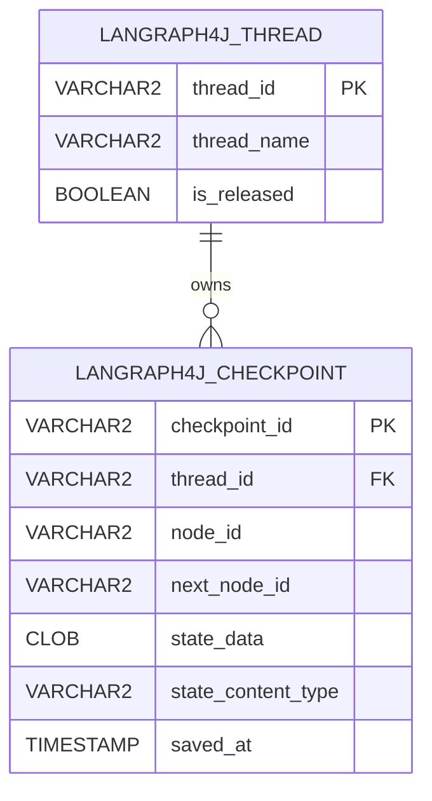

# Oracle Checkpoint Saver V1

Version 1 is implemented by `org.bsc.langgraph4j.checkpoint.OracleSaver`. It stores each LangGraph4j thread in `LANGRAPH4J_THREAD` and stores the thread's checkpoint history in `LANGRAPH4J_CHECKPOINT`.

V1 is useful for compatibility with the original Oracle saver schema. New applications should usually start with [SAVER_V2.md](./SAVER_V2.md).

## Data Architecture

The schema is defined in [`src/main/resources/db/migration/v1.1__init.sql`](./src/main/resources/db/migration/v1.1__init.sql).



`IDX_LANGRAPH4J_THREAD_NAME_RELEASED` supports finding the active row for a thread name.

## Design

`OracleSaver` stores a logical LangGraph4j thread name in `LANGRAPH4J_THREAD.thread_name`. Each new thread row has a UUID `thread_id`, and checkpoints reference that id.

When a checkpoint is saved, the saver:

1. Merges an unreleased `LANGRAPH4J_THREAD` row for the configured thread name when one does not already exist.
2. Inserts a `LANGRAPH4J_CHECKPOINT` row for the active thread with the checkpoint id, node ids, serialized state payload, and serializer content type.

State is serialized through the first configured `StateSerializer`. The binary serializer output is Base64 encoded and stored in `LANGRAPH4J_CHECKPOINT.state_data` as a `CLOB`.

The `state_content_type` column records the serializer content type. On read, the saver uses that content type to select a matching registered serializer.

## Release Behavior

Releasing a thread sets `LANGRAPH4J_THREAD.is_released` to `TRUE`. The checkpoint rows remain in `LANGRAPH4J_CHECKPOINT`, but normal V1 checkpoint loading searches only unreleased thread rows.

`OracleSaver.tag(config, version)` returns `Optional.empty()` in V1. Use V2 when you need versioned release history.

## Limitations

- No release tag table and no versioned lookup for released checkpoint histories.
- No persistent interruption state. `registerInterruption(...)` completes without changing the database.
- The schema does not declare `thread_name` unique; applications should avoid concurrent active executions with the same logical thread name.
- V1's current implementation uses the V1.1 schema, which adds `state_content_type`; the older V1.0 resource is retained only for legacy schema compatibility.

## Build a Saver

```java
import oracle.jdbc.datasource.OracleDataSource;
import org.bsc.langgraph4j.checkpoint.CreateOption;
import org.bsc.langgraph4j.checkpoint.OracleSaver;
import org.bsc.langgraph4j.serializer.std.ObjectStreamStateSerializer;
import org.bsc.langgraph4j.state.AgentState;

var dataSource = new OracleDataSource();
dataSource.setURL("jdbc:oracle:thin:@localhost:1521/FREEPDB1?oracle.jdbc.provider.json=jackson-json-provider");
dataSource.setUser("app_user");
dataSource.setPassword("app_password");

var saver = OracleSaver.builder()
        .dataSource(dataSource)
        .stateSerializer(new ObjectStreamStateSerializer<>(AgentState::new))
        .createOption(CreateOption.CREATE_IF_NOT_EXISTS)
        .build();
```

Use the saver when compiling a graph:

```java
var compileConfig = CompileConfig.builder()
        .checkpointSaver(saver)
        .releaseThread(false)
        .build();

var workflow = graph.compile(compileConfig);
```
