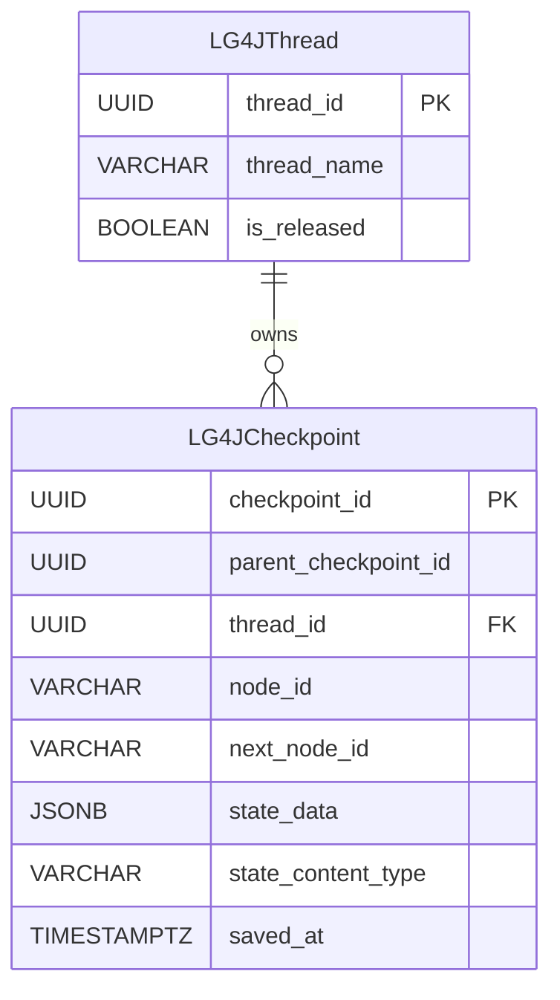

# PostgreSQL Checkpoint Saver V1

Version 1 is implemented by `org.bsc.langgraph4j.checkpoint.PostgresSaver`. It stores each active LangGraph4j thread in `LG4JThread` and stores the thread's checkpoint history in `LG4JCheckpoint`.

V1 is useful for compatibility with the original PostgreSQL saver schema. New applications should usually start with [SAVER_V2.md](./SAVER_V2.md).

## Data Architecture

The schema is defined in [`src/main/resources/db/migration/v1.0__init.sql`](./src/main/resources/db/migration/v1.0__init.sql).



Indexes:

- `idx_lg4jcheckpoint_thread_id` supports lookup by thread row.
- `idx_lg4jcheckpoint_thread_id_saved_at_desc` supports loading the newest checkpoints first.
- `idx_unique_lg4jthread_thread_name_unreleased` allows only one unreleased row for a given `thread_name`.

## Design

`PostgresSaver` stores a logical LangGraph4j thread name in `LG4JThread.thread_name`. The database row uses a generated UUID supplied by the saver and checkpoints reference that UUID.

When a checkpoint is saved, the saver:

1. Inserts an unreleased `LG4JThread` row if one does not already exist for the configured thread name.
2. Reads the active thread row id.
3. Inserts a `LG4JCheckpoint` row with the checkpoint id, node ids, serialized state payload, and serializer content type.

State is serialized through the configured `StateSerializer` and the `state_content_type` column records the serializer content type.
On read, the saver uses that content type to select a matching registered serializer.

## Release Behavior

Releasing a thread updates `LG4JThread.is_released` to `TRUE`. The checkpoints remain in `LG4JCheckpoint`, but normal V1 checkpoint loading only searches unreleased thread rows.

## Limitations

- No release tag table and no versioned lookup for released checkpoint histories.
- No persistent interruption state. `registerInterruption(...)` completes without changing the database.
- Only one active row per `thread_name` is allowed. If duplicate active rows exist, loading checkpoints fails.
- The schema uses UUID thread primary keys, while V2 uses database identity values for live threads.

## Build a Saver

Using direct PostgreSQL connection settings:

```java
import org.bsc.langgraph4j.checkpoint.PostgresSaver;
import org.bsc.langgraph4j.serializer.std.ObjectStreamStateSerializer;
import org.bsc.langgraph4j.state.AgentState;

var saver = PostgresSaver.builder()
        .host("localhost")
        .port(5432)
        .user("postgres")
        .password("postgres")
        .database("lg4j-store")
        .stateSerializer(new ObjectStreamStateSerializer<>(AgentState::new))
        .createTables(true)
        .build();
```

Using an existing `DataSource`:

```java
import org.bsc.langgraph4j.checkpoint.PostgresSaver;
import org.bsc.langgraph4j.serializer.std.ObjectStreamStateSerializer;
import org.bsc.langgraph4j.state.AgentState;
import org.postgresql.ds.PGSimpleDataSource;

var dataSource = new PGSimpleDataSource();
dataSource.setServerNames(new String[] {"localhost"});
dataSource.setPortNumbers(new int[] {5432});
dataSource.setDatabaseName("lg4j-store");
dataSource.setUser("postgres");
dataSource.setPassword("postgres");

var saver = PostgresSaver.builder()
        .datasource(dataSource)
        .stateSerializer(new ObjectStreamStateSerializer<>(AgentState::new))
        .createTables(true)
        .build();
```

Use the saver when compiling a graph:

```java
var compileConfig = CompileConfig.builder()
        .checkpointSaver(saver)
        .releaseThread(false)
        .build();

var workflow = graph.compile(compileConfig);
```