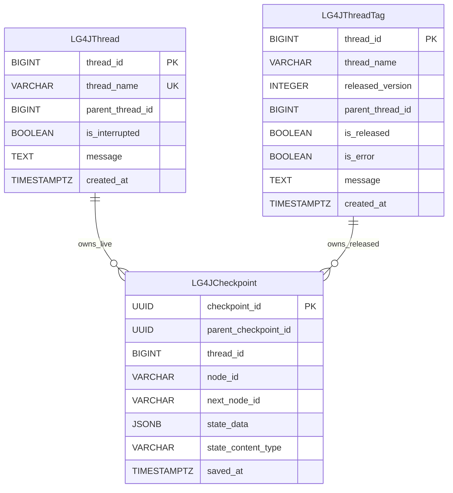

# PostgreSQL Checkpoint Saver V2

Version 2 is implemented by `org.bsc.langgraph4j.checkpoint.PostgresSaverV2`. It extends the original PostgreSQL saver model with release tags, error metadata, and interruption state.

Use V2 for new applications unless you must keep compatibility with an existing [V1](./SAVER_V1.md) schema.

## Data Architecture

The schema is defined in [`src/main/resources/db/migration/v2.0__init.sql`](./src/main/resources/db/migration/v2.0__init.sql).



The `LG4JCheckpoint.thread_id` column stores the row id that came from `LG4JThread`. The migration currently leaves the foreign key definition commented out so released checkpoints can continue to reference the archived row id after the live thread is deleted.

Indexes:

- `idx_lg4jcheckpoint_thread_id` supports lookup by thread row.
- `idx_lg4jcheckpoint_thread_id_saved_at_desc` supports loading checkpoint histories newest first.
- `idx_lg4jthreadtag_thread_name_released_version` supports versioned released-thread lookup.

## Design

V2 keeps only active executions in `LG4JThread`. The row id is a PostgreSQL identity value, and `thread_name` is unique.

When a checkpoint is saved, the saver:

1. Inserts or refreshes the live `LG4JThread` row for the logical thread name.
2. Reads the `thread_id` identity value.
3. Inserts a `LG4JCheckpoint` row that references that identity value.

When the thread is released, the saver:

1. Copies the live thread row into `LG4JThreadTag`.
2. Assigns the next `released_version` for the same `thread_name`.
3. Records release status, error status, optional message, and original creation time.
4. Deletes the live row from `LG4JThread`.

The checkpoint rows remain associated with the same numeric `thread_id`, which is now represented by `LG4JThreadTag.thread_id`.

## State Serialization

Serializes state through the configured `StateSerializer` and the `state_content_type` records the serializer content type so the saver can select the correct registered serializer while loading checkpoints or tags.

## Release Tags

`PostgresSaverV2.tag(config, version)` loads checkpoints for a released version from `LG4JThreadTag`.

```java
var config = RunnableConfig.builder()
        .threadId("customer-support-thread")
        .build();

var releasedVersion = saver.tag(config, 1);
```

## Interruption Metadata

`registerInterruption(...)` updates the active `LG4JThread` row by setting `is_interrupted = TRUE` and storing the interruption reason in `message`. This lets external tools or dashboards see that a live thread is waiting for intervention.

## Limitations

- V2 is not schema-compatible with V1. Existing V1 tables require an explicit migration plan before switching classes.
- `LG4JCheckpoint.thread_id` has no active foreign-key constraint in the bundled migration. This is intentional for archived tags, but database cleanup must account for it.
- `thread_name` is unique among live threads, so concurrent executions with the same logical thread name share the same active row.
- Released checkpoints are loaded through `tag(...)`; normal checkpoint loading reads the live thread table.

## Build a Saver

Using direct PostgreSQL connection settings:

```java
import org.bsc.langgraph4j.checkpoint.PostgresSaverV2;
import org.bsc.langgraph4j.serializer.std.ObjectStreamStateSerializer;
import org.bsc.langgraph4j.state.AgentState;

var saver = PostgresSaverV2.builder()
        .host("localhost")
        .port(5432)
        .user("postgres")
        .password("postgres")
        .database("lg4j-store")
        .stateSerializer(new ObjectStreamStateSerializer<>(AgentState::new))
        .createTables(true)
        .build();
```

Using an existing `DataSource`:

```java
import org.bsc.langgraph4j.checkpoint.PostgresSaverV2;
import org.bsc.langgraph4j.serializer.std.ObjectStreamStateSerializer;
import org.bsc.langgraph4j.state.AgentState;
import org.postgresql.ds.PGSimpleDataSource;

var dataSource = new PGSimpleDataSource();
dataSource.setServerNames(new String[] {"localhost"});
dataSource.setPortNumbers(new int[] {5432});
dataSource.setDatabaseName("lg4j-store");
dataSource.setUser("postgres");
dataSource.setPassword("postgres");

var saver = PostgresSaverV2.builder()
        .datasource(dataSource)
        .stateSerializer(new ObjectStreamStateSerializer<>(AgentState::new))
        .createTables(true)
        .build();
```

Use the saver when compiling a graph:

```java
var compileConfig = CompileConfig.builder()
        .checkpointSaver(saver)
        .releaseThread(false)
        .build();

var workflow = graph.compile(compileConfig);
```

## Migration Resource

For managed database migrations, apply:

```text
src/main/resources/db/migration/v2.0__init.sql
```
