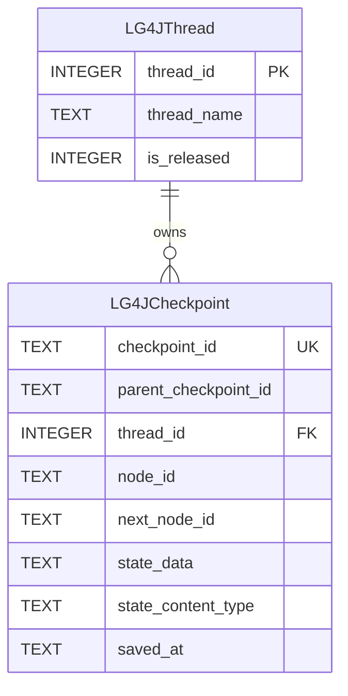

# SQLite Checkpoint Saver V1

Version 1 is implemented by `org.bsc.langgraph4j.checkpoint.SQLiteSaver`. It stores each active LangGraph4j thread in `LG4JThread` and stores the thread's checkpoint history in `LG4JCheckpoint`.

V1 is useful for compatibility with the original SQLite saver schema. New applications should usually start with [SAVER_V2.md](./SAVER_V2.md).

## Data Architecture

The schema is defined in [`src/main/resources/db/migration/v1.0__init.sql`](./src/main/resources/db/migration/v1.0__init.sql).



Indexes:

- `idx_lg4jcheckpoint_thread_id` supports lookup by thread row.
- `idx_lg4jcheckpoint_thread_id_saved_at_desc` supports loading the newest checkpoints first.
- `idx_unique_lg4jthread_thread_name_unreleased` allows only one unreleased row for a given `thread_name`.

## Design

`SQLiteSaver` stores a logical LangGraph4j thread name in `LG4JThread.thread_name`. The database row uses an SQLite `INTEGER PRIMARY KEY AUTOINCREMENT` value, and checkpoints reference that row id.

When a checkpoint is saved, the saver:

1. Inserts an unreleased `LG4JThread` row if one does not already exist for the configured thread name.
2. Reads the active thread row id with SQLite `RETURNING`.
3. Inserts a `LG4JCheckpoint` row with the checkpoint id, node ids, serialized state payload, and serializer content type.

State is serialized through the configured `StateSerializer`. The binary serializer output is Base64 encoded and stored directly in `LG4JCheckpoint.state_data` as `TEXT`.

The `state_content_type` column records the serializer content type. On read, the saver uses that content type to select a matching registered serializer.

## Release Behavior

Releasing a thread updates `LG4JThread.is_released` to `1`. The checkpoints remain in `LG4JCheckpoint`, but normal V1 checkpoint loading only searches unreleased thread rows.

`SQLiteSaver.tag(config, version)` returns `Optional.empty()` in V1. Use V2 when you need versioned release history.

## Limitations

- No release tag table and no versioned lookup for released checkpoint histories.
- No persistent interruption state. `registerInterruption(...)` completes without changing the database.
- Only one active row per `thread_name` is allowed. If the active row is released, later checkpoint loading will not find it.
- Boolean values are stored as checked integer values, where `0` is false and `1` is true.
- `checkpoint_id` is unique but not declared as the table primary key in the bundled schema.

## Build a Saver

Using a database path:

```java
import org.bsc.langgraph4j.checkpoint.SQLiteSaver;
import org.bsc.langgraph4j.serializer.std.ObjectStreamStateSerializer;
import org.bsc.langgraph4j.state.AgentState;

var saver = SQLiteSaver.builder()
        .databasePath("target/lg4j-store.db")
        .stateSerializer(new ObjectStreamStateSerializer<>(AgentState::new))
        .createTables(true)
        .build();
```

Using a full JDBC URL:

```java
var saver = SQLiteSaver.builder()
        .url("jdbc:sqlite:target/lg4j-store.db")
        .stateSerializer(new ObjectStreamStateSerializer<>(AgentState::new))
        .createTables(true)
        .build();
```

Using an existing `DataSource`:

```java
import org.bsc.langgraph4j.checkpoint.SQLiteSaver;
import org.bsc.langgraph4j.serializer.std.ObjectStreamStateSerializer;
import org.bsc.langgraph4j.state.AgentState;
import org.sqlite.SQLiteDataSource;

var dataSource = new SQLiteDataSource();
dataSource.setUrl("jdbc:sqlite:target/lg4j-store.db");

var saver = SQLiteSaver.builder()
        .datasource(dataSource)
        .stateSerializer(new ObjectStreamStateSerializer<>(AgentState::new))
        .createTables(true)
        .build();
```

Use the saver when compiling a graph:

```java
var compileConfig = CompileConfig.builder()
        .checkpointSaver(saver)
        .releaseThread(false)
        .build();

var workflow = graph.compile(compileConfig);
```

