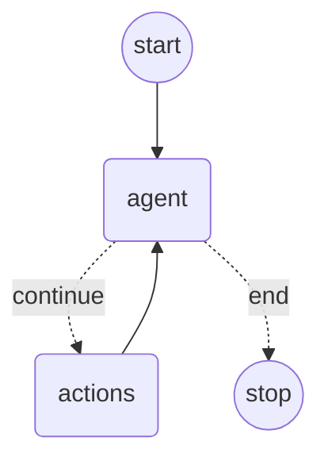
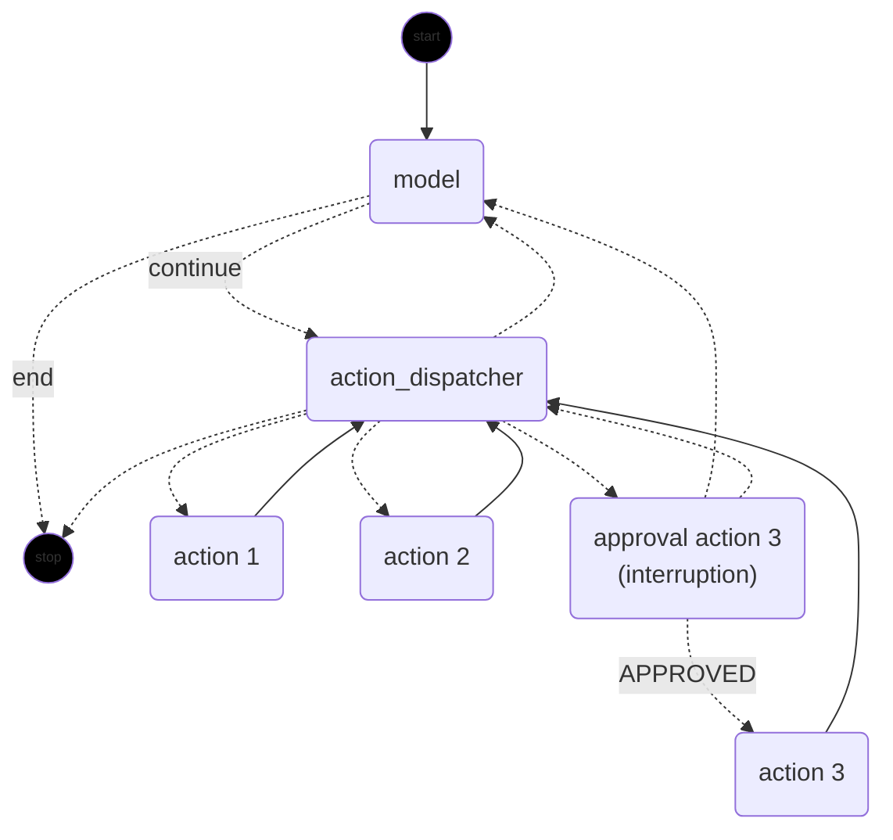

#  Spring AI Integrations


`langgraph4j-springai-agentexecutor` provides ReAct-style agents built on LangGraph4j and Spring AI `ChatModel`. Use it when you want a ready-to-run agent loop with tool callbacks, streaming output, approvals, or sub-agents instead of wiring every node manually.

## Features

- `AgentExecutor` for a compact ReAct graph with `agent -> action -> agent` execution.
- `AgentExecutorEx` for explicit tool-dispatch nodes, approval gates, and richer orchestration.
- Streaming support backed by Spring AI `ChatModel` responses.
- Tool registration from `ToolCallback`, `ToolCallbackProvider`, or annotated tool objects.
- Optional LangGraph Studio integration for interactive graph execution.

## Agent Executor Diagram 



## AgentExecutorEx Diagram



## Installation

```xml
<dependency>
    <groupId>org.bsc.langgraph4j</groupId>
    <artifactId>langgraph4j-springai-agentexecutor</artifactId>
    <version>1.9.0-beta4</version>
</dependency>
```

This module depends on `langgraph4j-spring-ai` and targets Java 17.

## Usage

### Configure a `ChatModel`

```java
@Configuration
public class ChatModelConfiguration {

    @Bean
    @Profile("ollama")
    ChatModel ollamaModel() {
        return OllamaChatModel.builder()
                .ollamaApi(new OllamaApi("http://localhost:11434"))
                .defaultOptions(OllamaOptions.builder()
                        .model("qwen2.5:7b")
                        .temperature(0.1)
                        .build())
                .build();
    }
}
```

### Build and run an agent

```java
var agent = AgentExecutor.builder()
        .chatModel(chatModel)
        .tools(tools)
        .build()
        .compile();

var result = agent.stream(
        GraphInput.args(Map.of("messages", new UserMessage("what is 234 + 45?"))),
        RunnableConfig.empty());

var finalState = result.stream()
        .reduce((a, b) -> b)
        .orElseThrow()
        .state();
```

The default state type is `AgentExecutor.State`, which extends `MessagesState<Message>`.

### Enable streaming and tool extraction from an object

```java
var agent = AgentExecutor.builder()
        .chatModel(chatModel)
        .streaming(true)
        .emitStreamingEnd(true)
        .toolsFromObject(new TestTools())
        .build()
        .compile(compileConfig);
```

### Use `AgentExecutorEx` when you need approvals or sub-agents

```java
var agent = AgentExecutorEx.builder()
        .chatModel(chatModel)
        .streaming(true)
        .approvalOn("threadCount", (nodeId, state) ->
                InterruptionMetadata.builder(nodeId, state)
                        .addMetadata("label", "confirm thread count execution?")
                        .build())
        .toolsFromObject(new TestTools())
        .build(compileConfig);
```

`AgentExecutorEx.State` adds channels for pending tool execution requests, tool responses, and next-action dispatching. This is the variant used by the test applications when approval flows or sub-agents are involved.


## LangGraph Studio

The test configuration in `src/test/java/.../LangGraphStudioConfiguration.java` shows how to expose an `AgentExecutorEx` graph through `LangGraphStudioConfig`, backed by a `MemorySaver` checkpoint store.

## Related Documentation

- [Spring AI integration overview](../README.md)
- [Core Spring AI utilities](../spring-ai-core/README.md)

[Spring AI]: https://docs.spring.io/spring-ai/reference/index.html
