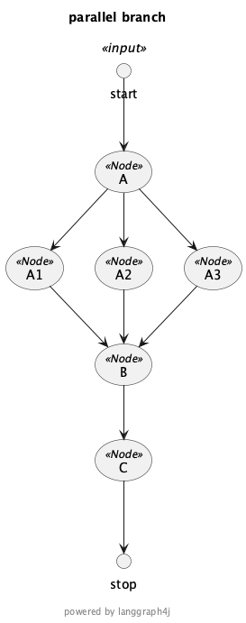
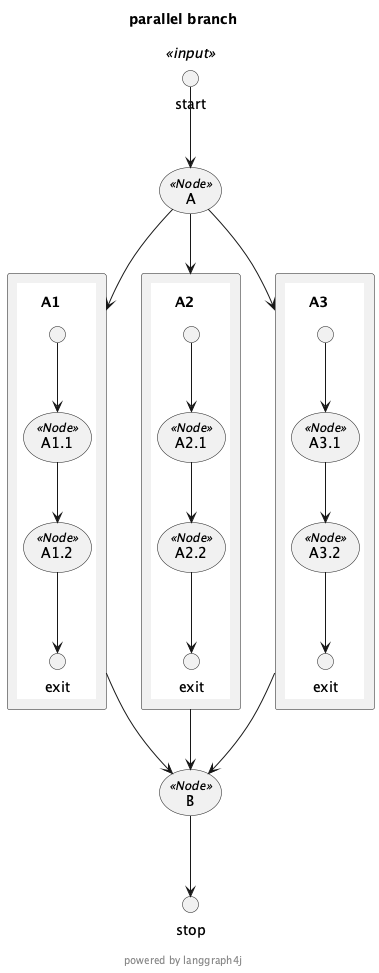

# Parallel nodes definition

LangGraph4j lets you run nodes in parallel to speed up your total graph execution.

‼️ Currently there are some overall **limitations** on parallel node implementation execution:

 
* Only the **Fork-Join** model is supported
    
```
          ┌─┐
          │A│      
          └─┘       
           |        
     ┌-----------┐  
     |     |     |  
   ┌──┐  ┌──┐  ┌──┐ 
   │A1│  │A2│  │A3│ 
   └──┘  └──┘  └──┘ 
     |     |     |  
     └-----------┘  
           |        
          ┌─┐       
          │B│       
          └─┘       
```
* Only **one paraller step** is allowed 
```
          ┌─┐
          │A│      
          └─┘       
           |        
     ┌-----------┐  
     |     |     |  
   ┌──┐  ┌──┐  ┌──┐ 
   │A1│  │A2│  │A3│ 
   └──┘  └──┘  └──┘ 
     |     |     |  
   ┌──┐    |     |    
   │A4│ ❌ Not Allowed  
   └──┘    |     |   
     |     |     |  
     └-----------┘  
           |        
          ┌─┐       
          │B│       
          └─┘       
```

* No **Conditional Edges** are allowed
  
Below are some examples showing how to add create branching dataflows.

## Define Graph with parallel nodes

It is enough to associate to the same edges multiple nodes.

### Example - Pefine parallel nodes

```java
var workflow = new MessagesStateGraph<String>()
                .addNode("A", makeNode("A"))
                .addNode("A1", makeNode("A1"))
                .addNode("A2", makeNode("A2"))
                .addNode("A3", makeNode("A3"))
                .addNode("B", makeNode("B"))
                .addNode("C", makeNode("C"))
                .addEdge("A", "A1")
                .addEdge("A", "A2")
                .addEdge("A", "A3")
                .addEdge("A1", "B")
                .addEdge("A2", "B")
                .addEdge("A3", "B")
                .addEdge("B", "C")
                .addEdge(START, "A")
                .addEdge("C", END)                   
                .compile();

```

**diagram**




You can also return on a specific parallel node only after all parallel execution is end

```java
var workflow = new MessagesStateGraph<String>()
                .addNode("A", makeNode("A"))
                .addNode("A1", makeNode("A1"))
                .addNode("A2", makeNode("A2"))
                .addNode("A3", makeNode("A3"))
                .addNode("B", makeNode("B"))
                .addNode("C", makeNode("C"))
                .addEdge("A", "A1")
                .addEdge("A", "A2")
                .addEdge("A", "A3")
                .addEdge("A1", "B")
                .addEdge("A2", "B")
                .addEdge("A3", "B")
                // .addEdge("B", "C")
                .addConditionalEdges( "B", 
                    edge_async( state -> 
                        state.lastMinus(1) 
                            .filter( m -> Objects.equals(m,"A3"))
                            .map( m -> "continue" )
                            .orElse("back") ), 
                    EdgeMappings.builder()
                        .to( "A1", "back" )
                        .to( "C" , "continue")
                        .build()
                 )
                .addEdge(START, "A")
                .addEdge("C", END)                   
                .compile();

```
    

    

## Use compiled sub graph as parallel node

To overcome the problem of supporting a single step in parallel branch, we can use the subgraphs.
This example answer to issue **Will plan support multiple target on parallel node?** [#104](https://github.com/langgraph4j/langgraph4j/issues/104) 


### Example - Mix nodes and subgraphs
```java
var subgraphA3 = new MessagesStateGraph<String>()
                .addNode("A3.1", makeNode("A3.1"))
                .addNode("A3.2", makeNode("A3.2"))
                .addEdge(START, "A3.1")
                .addEdge( "A3.1", "A3.2")
                .addEdge("A3.2", END)   
                .compile(); 
var subgraphA1 = new MessagesStateGraph<String>()
                .addNode("A1.1", makeNode("A1.1"))
                .addNode("A1.2", makeNode("A1.2"))
                .addEdge(START, "A1.1")
                .addEdge( "A1.1", "A1.2")
                .addEdge("A1.2", END)   
                .compile(); 

var workflow = new MessagesStateGraph<String>()
                .addNode("A", makeNode("A"))
                .addNode("A1", subgraphA1)
                .addNode("A2", makeNode("A2"))
                .addNode("A3", subgraphA3)
                .addNode("B", makeNode("B"))
                .addEdge("A", "A1")
                .addEdge("A", "A2")
                .addEdge("A", "A3")
                .addEdge("A1", "B")
                .addEdge("A2", "B")
                .addEdge("A3", "B")
                .addEdge(START, "A")
                .addEdge("B", END)                   
                .compile();

```

**diagram**    


### Example - Only subgraphs
```java
var subgraphA3 = new MessagesStateGraph<String>()
                .addNode("A3.1", makeNode("A3.1"))
                .addNode("A3.2", makeNode("A3.2"))
                .addEdge(START, "A3.1")
                .addEdge( "A3.1", "A3.2")
                .addEdge("A3.2", END)   
                .compile(); 

var subgraphA2 = new MessagesStateGraph<String>()
                .addNode("A2.1", makeNode("A2.1"))
                .addNode("A2.2", makeNode("A2.2"))
                .addEdge(START, "A2.1")
                .addEdge( "A2.1", "A2.2")
                .addEdge("A2.2", END)   
                .compile(); 

var subgraphA1 = new MessagesStateGraph<String>()
                .addNode("A1.1", makeNode("A1.1"))
                .addNode("A1.2", makeNode("A1.2"))
                .addEdge(START, "A1.1")
                .addEdge( "A1.1", "A1.2")
                .addEdge("A1.2", END)   
                .compile(); 

var workflow = new MessagesStateGraph<String>()
                .addNode("A", makeNode("A"))
                .addNode("A1", subgraphA1)
                .addNode("A2", subgraphA2)
                .addNode("A3", subgraphA3)
                .addNode("B", makeNode("B"))
                .addEdge("A", "A1")
                .addEdge("A", "A2")
                .addEdge("A", "A3")
                .addEdge("A1", "B")
                .addEdge("A2", "B")
                .addEdge("A3", "B")
                .addEdge(START, "A")
                .addEdge("B", END)                   
                .compile();
```

**diagram** 




----

Take a look 👀 to [parallel-branch.ipynb] to understand the run-time behaviours


[parallel-branch.ipynb]: /langgraph4j/how-tos/parallel-branch

